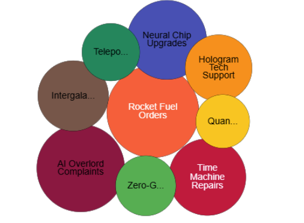

# bubble-chart-js

bubbleChartJs is a lightweight and customizable JavaScript library for creating stacked bubble charts, arranging bubbles by size with the largest at the top.


> Built for dashboards with multiple widgets and real-world data visualization needs.

## Preview



## Why bubble-chart-js?

✔ Automatically arranges bubbles by value (largest on top)
✔ Clean stacked layout – no overlaps
✔ Interactive tooltips & click events
✔ Works with plain JS & TypeScript
✔ Zero dependencies

## Quick Start

```js
import { initializeChart } from "bubble-chart-js";

initializeChart({
  canvasContainerId: "bubbleChart",
  data: [
    { label: "Orders", value: 207, bubbleColor: "#ff5733" },
    { label: "Returns", value: 96, bubbleColor: "#4caf50" },
  ],
});
```

That’s it. Chart rendered.

### ✨ Why Use a Stacked Bubble Chart?

Multi-Dimensional Data Representation – Visualizes multiple datasets at once.

Better Group Comparisons – Highlights relationships between different categories.

Enhanced Readability – Shows data trends with layered or clustered bubbles.

Customizable & Interactive – Allows tooltips.

### 🔧 Features

✔️ Supports stacked or grouped bubble layouts

✔️ Customizable bubble color

✔️ Fully compatible with JavaScript & Typescript

✔️ Interactive tooltips and hover effects

### Installation

You can install `bubbleChartJs` via npm:

```sh
npm install bubble-chart-js
```

## Advanced Usage

```js
import BubbleChart from "bubblechartjs";

const tooltipOptions = {
  fontStyle: "italic",
  fontWeight: 800,
  textAlign: "center",
  textDecoration: "underline",
  textTransform: "uppercase",
  fontColor: "#FFF",
};

const data = [
  {
    label: "Rocket Fuel Orders",
    value: 207,
    bubbleColor: "#ff5733",
    fontColor: "#FFFFFF",
    fontWeight: 600,
  },
  {
    label: "Time Machine Repairs",
    value: 154,
    bubbleColor: "#c70039",
    fontColor: "#FFF",
    fontWeight: 600,
  },
  {
    label: "AI Overlord Complaints",
    value: 192,
    bubbleColor: "#900c3f",
    fontColor: "#000",
  },
  {
    label: "Quantum Internet Activation",
    value: 73,
    bubbleColor: "#ffc300",
    fontColor: "#000",
  },
  {
    label: "Zero-Gravity Plumbing Issues",
    value: 96,
    bubbleColor: "#4caf50",
    fontColor: "#000",
  },
  {
    label: "Hologram Tech Support",
    value: 119,
    bubbleColor: "#ff8c00",
    fontColor: "#000",
  },
  {
    label: "Teleportation Delay Reports",
    value: 87,
    bubbleColor: "#03875c",
    fontColor: "#000",
  },
  {
    label: "Neural Chip Upgrades",
    value: 163,
    bubbleColor: "#3f51b5",
    fontColor: "#000",
  },
  {
    label: "Intergalactic Toll Fees",
    value: 132,
    bubbleColor: "#795548",
    fontColor: "#000",
  },
];

const chartOptions = {
  canvasContainerId: "bubbleChart",
  data: data,
  fontSize: 10,
  onBubbleClick: (bubbleData, event) => {
    alert(`You clicked on: ${bubbleData.label}`);
  },
};

// Initialize chart
initializeChart(chartoptions);
```

## Configuration Options

| Property                           | Type         | Required | Optional | Description                                                                                       | Default     |
| ---------------------------------- | ------------ | -------- | -------- | ------------------------------------------------------------------------------------------------- | ----------- |
| `canvasContainerId`                | `string`     | ✔️ Yes   | ❌ No    | The ID of the container where the chart will be rendered.                                         | `-`         |
| `data`                             | `DataItem[]` | ✔️ Yes   | ❌ No    | An array of objects containing `label` and `value` for each bubble.                               | `-`         |
| `defaultBubbleColor`               | `string`     | ❌ No    | ✔️ Yes   | Default color for bubbles if not specified in `colorMap`.                                         | `"#3498db"` |
| `fontSize`                         | `number`     | ❌ No    | ✔️ Yes   | Font size for bubble labels.                                                                      | `14`        |
| `fontFamily`                       | `string`     | ❌ No    | ✔️ Yes   | Font family for text rendering.                                                                   | `"Arial"`   |
| `fontColor`                        | `string`     | ❌ No    | ✔️ Yes   | Color of the text inside bubbles.                                                                 | `"#ffffff"` |
| `minRadius`                        | `number`     | ❌ No    | ✔️ Yes   | Minimum radius for the bubbles.                                                                   | `10`        |
| `maxLines`                         | `number`     | ❌ No    | ✔️ Yes   | Maximum number of lines allowed for text wrapping.                                                | `3`         |
| `textWrap`                         | `boolean`    | ❌ No    | ✔️ Yes   | Enables or disables text wrapping inside bubbles.                                                 | `true`      |
| `isResizeCanvasOnWindowSizeChange` | `boolean`    | ❌ No    | ✔️ Yes   | Whether the chart should resize when the window size changes.                                     | `true`      |
| `showToolTip`                      | `boolean`    | ❌ No    | ✔️ Yes   | Whether the chart should display the tooltip or not.                                              | `true`      |
| `onBubbleClick`                    | `method`     | ❌ No    | ✔️ Yes   | Callback function triggered when a bubble is clicked. Provides the clicked bubble data and event. | `true`      |

✔️ **Required**: These properties must be provided.
✔️ **Optional**: If not provided, the default value will be used.

### 📌 Use Cases

Financial Analysis – Display investment risks vs. returns for multiple assets.

Social Media Metrics – Visualize engagement levels across platforms.

Scientific Research – Show relationships in grouped experimental data.

## Live Demo

🚀 **Try it live on Stackblitz**
https://stackblitz.com/edit/bubble-chart-js?file=main.js

🚀 **Try it live on CodeSandbox**
https://codesandbox.io/p/sandbox/xenodochial-cherry-4yrcnk

## 📦 Package

- **npm (public)**
  https://www.npmjs.com/package/bubble-chart-js

- **GitHub Packages (npm)**
  https://github.com/Praga-Dev?tab=packages

## License

This project is licensed under the MIT License.

## Contributions

Contributions, issues, and feature requests are welcome!

---

Made with ❤️ by Pragadeesh
